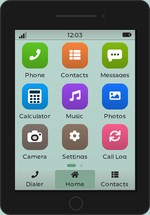

# Cell Phone Demo

A phone UI demo for LVGL.
Pure C99, no external dependencies beyond LVGL and SDL2 (for the PC simulator).



## Quick start (macOS / Linux)

The fastest path is the bundled driver script `demos/cellphone/build.sh`.
It runs cmake/ninja for you, links the SDL host or test binary against
`liblvgl_demos.a`, and adapts linker flags per platform (no `-framework
Cocoa` on Linux).

```bash
demos/cellphone/build.sh             # build lvgl libs + cellphone_demo binary
demos/cellphone/build.sh demo        # build + launch the SDL demo window
demos/cellphone/build.sh test        # build + run the regression test
demos/cellphone/build.sh report      # test build with the heap-breakdown diagnostic
demos/cellphone/build.sh screenshot  # capture lock + home PNGs into screenshots/
demos/cellphone/build.sh clean       # remove build/
demos/cellphone/build.sh help        # print usage
```

Outputs land in `build/`:
- `build/cellphone_demo` -- interactive SDL window
- `build/cellphone_test` -- non-interactive harness (`test` mode)
- `build/cellphone_test_report` -- same harness plus heap census (`report` mode)
- `build/cellphone_test_screenshot` -- harness with `lv_snapshot_take`
  capture, used by `screenshot` mode (also requires ImageMagick's
  `convert` for the PPM->PNG step)

Prerequisites: `cmake`, `ninja`, a C compiler, `sdl2` discoverable via
`pkg-config`. The script uses the cellphone config under
`demos/cellphone/config/` automatically.

### What the script runs (for reference)

If you prefer to drive the build by hand, the script collapses to:

```bash
# 1. Configure and build LVGL
cmake -B build -GNinja -DCMAKE_BUILD_TYPE=Debug \
  -DLV_BUILD_SET_CONFIG_OPTS=ON \
  -DLV_BUILD_CONF_DIR=demos/cellphone/config
cmake --build build --parallel

# 2. Build the demo host (drop `-framework Cocoa` on Linux)
cc -o build/cellphone_demo demos/cellphone/main_sdl.c \
   -I. -Ibuild -Idemos/cellphone/config -DLV_CONF_INCLUDE_SIMPLE \
   -Lbuild/lib -llvgl_demos -llvgl_examples -llvgl \
   $(pkg-config --cflags --libs sdl2) \
   -framework Cocoa -lpthread

# 3. Run
build/cellphone_demo
```

## Screen layout

Portrait QVGA (240 x 320):

```
+----------------------------+
| Status Bar (20 px)  HH:MM  |
+----------------------------+
|                            |
|      Content Area          |
|      240 x 268             |
|                            |
+----------------------------+
| Nav Bar (32 px)            |
|      [Back]   [Home]       |
+----------------------------+
```

The lock screen is full-screen and hides the status/nav bar until
the user slides to unlock.

## Applications

| App | Source file | Widget | Description |
|-----|-----------|--------|-------------|
| Lock screen | `lv_demo_cellphone_lock.c` | slider | Clock, date, slide-to-unlock with breathing hint |
| Home | `lv_demo_cellphone_home.c` | tileview + grid | 12 apps across two 3x3 pages, modern squircle icons |
| Phone | `lv_demo_cellphone_dialer.c` | buttonmatrix | 3x4 keypad, mock in-call screen |
| Contacts | `lv_demo_cellphone_contacts.c` | list | A-Z grouped list, detail view |
| Messages | `lv_demo_cellphone_sms.c` | list + labels | Conversation list, chat bubbles |
| Calculator | `lv_demo_cellphone_calc.c` | buttonmatrix | Working arithmetic (scaled integer) |
| Music | `lv_demo_cellphone_music.c` | list + slider | Track list, simulated playback |
| Photos | `lv_demo_cellphone_photo.c` | grid + tileview | 3x2 JPEG grid, fullscreen swipe |
| Camera | `lv_demo_cellphone_camera.c` | composite | Faux viewfinder scene with HDR/12 MP overlays |
| Settings | `lv_demo_cellphone_settings.c` | menu | Display, Sound, Wallpaper, Time, About |
| Call Log | `lv_demo_cellphone_calllog.c` | custom list | Color-coded direction icons |
| Snake / Pong / Tetris | `lv_demo_cellphone_game.c` | custom canvas | Autoplay arcade demos (single shared dispatch) |

## Architecture

```
lv_demo_cellphone.c        Entry point, screen stack, app registry, font init, theme/clock helpers
lv_demo_cellphone_common.h Geometry, colors, fonts, shared types, obj-recipe helpers
lv_demo_cellphone_statusbar.c/h  Persistent top bar (real-time clock)
lv_demo_cellphone_navbar.c/h     Persistent bottom bar (Back / Home)
lv_demo_cellphone_data.c/h       Static datasets (contacts, SMS, call log, tracks)
lv_demo_cellphone_anim.c/h       Shared animation primitives (pickup/drop scale + one-shot
                                 lv_anim_run helper + per-property setter callbacks)
lv_demo_cellphone_skin.c/h       Optional bezel + LCD-tint chrome (SDL only)
mem_report.c/h                   Optional heap census (compiled only with `report` mode)
```

`lv_demo_cellphone_common.h` exposes a small family of object-recipe
helpers used across every screen so the same boilerplate doesn't get
re-written: `cellphone_obj_bare` (lv_obj + remove_style_all),
`cellphone_obj_fill` (bare + bg color), `cellphone_obj_bar` (bare + 2-stop
gradient), `cellphone_obj_transparent` (bare + transparent + no border +
non-scrollable; used wherever a hit-test surface needs no painting),
`cellphone_section_header`, and `cellphone_label`.

### Screen stack

Navigation uses a push/pop stack (max depth 8). Each app screen is
created inside a content container positioned between the status bar
and nav bar. Transitions animate the X position of incoming and
outgoing pages.

```c
cellphone_screen_push(app_create_fn);   /* slide in from right */
cellphone_screen_pop();                 /* slide out to right   */
cellphone_screen_home();                /* fade all, back to home */
```

### Data layer

All demo data (12 contacts, 4 SMS threads, 15 call log entries,
10 music tracks) is compiled in as `static const` arrays in
`lv_demo_cellphone_data.c`. No filesystem, no SQLite.

## Assets

Most of the demo remains asset-light: home-screen icons are rendered
procedurally each paint tick from squircle plates, FA5 glyphs, and a
small set of hand-tuned draw primitives. `Photos` is the only screen
that touches an external filesystem.

### `Photos` source mode

`LV_DEMO_CELLPHONE_PHOTOS_SOURCE` selects the handler at compile time:

| Value | Mode  | Behavior |
|-------|-------|----------|
| `0` (default) | Auto  | Real JPEG if `LV_USE_TJPGD` and `LV_USE_FS_STDIO` are on **and** the asset directory is reachable at runtime; dummy otherwise |
| `1` | Forced real | Use real JPEG; surface an in-app "unavailable" notice if the decoder stack is missing or the directory probe fails |
| `2` | Forced dummy | Skip the JPEG path entirely (no decoder, no filesystem) |

The shipped simulator configs (`lv_conf.h`, `lv_conf_mcu_test.h`) leave
the demo on Auto with real-JPEG support compiled in; the MCU shipping
profile (`lv_conf_mcu.h`) hard-codes mode `2` to keep TJPGD and stdio
out of the build.

### Asset path resolution

Real-JPEG paths are built at compile time as
`P:<CELLPHONE_PHOTOS_DIR>/{thumbs,view}/<stem>_{thumb,view}.jpg`, where
`P:` is the `LV_FS_STDIO_LETTER` set in the cellphone configs and
`CELLPHONE_PHOTOS_DIR` defaults to the relative string
`"demos/cellphone/assets/photos"`. That default only resolves correctly
when the binary is run from the project root. To bake in an absolute
path, configure with:

```bash
cmake -DLV_DEMO_CELLPHONE_PHOTOS_DIR=/absolute/path/to/photos ...
```

The cmake glue at `env_support/cmake/main.cmake` resolves the value
against `CMAKE_SOURCE_DIR` if it's relative and injects it into the
`lvgl_demos` target as `-DCELLPHONE_PHOTOS_DIR=...`. `build.sh` does
this automatically with the in-tree fixture path.

### Runtime fallback

On the first source-mode query the demo probes one canonical asset
(`thumbs/bob_kerrey_portrait_thumb.jpg`) via `lv_fs_path_get_size`. The
result is cached for the process. If the probe fails — wrong working
directory, missing FS letter, deleted assets — Auto mode silently drops
to dummy art, while Forced-real shows the in-app notice. The dummy path
has no external dependency, so the screen always reaches a usable
state. `cellphone_photo_source_name()` returns one of `"real-jpeg"`,
`"dummy"`, `"dummy-assets-missing"`, or `"unavailable-real-jpeg"` for
diagnostics.

### Fixture set

Six public-domain photos from Wikimedia Commons live under
`demos/cellphone/assets/photos/`. Each has a 74x74 thumbnail under
`thumbs/` and a 240x258 viewer copy under `view/`; the original
masters sit at the directory root and are not loaded at runtime. See
`demos/cellphone/assets/photos/ATTRIBUTION.md` for source URLs and
license bases.

## Configuration

Enable in `lv_conf.h`:

```c
#define LV_USE_DEMO_CELLPHONE  1
```

Two opt-in configs ship with the demo:

| File | Profile | Notes |
|---|---|---|
| `demos/cellphone/config/lv_conf.h`     | SDL simulator | 1 MiB pool, logger on, snapshot/skin enabled |
| `demos/cellphone/config/lv_conf_mcu.h` | MCU shipping  | 76 KiB pool, no SDL/snapshot/skin/logger     |

Use either with `cmake -DLV_BUILD_CONF_DIR=demos/cellphone/config` (picks
`lv_conf.h`) or with the explicit `-DLV_BUILD_CONF_PATH=...lv_conf_mcu.h`.

Required LVGL features (both profiles): `LV_USE_FLEX`, `LV_USE_GRID`,
`LV_USE_LIST`, `LV_USE_MENU`, `LV_USE_TILEVIEW`, `LV_USE_BUTTONMATRIX`,
`LV_USE_SLIDER`, `LV_USE_ROLLER`, `LV_USE_FONT_VEC`. Bitmap Montserrat
fonts are not used; the vector font engine renders all text and FA5
icons. Per-font L2 cache budgets via `lv_font_vec_init_ex()`:

| Slot           | Budget | Why                                                            |
|----------------|--------|----------------------------------------------------------------|
| sm (12 px)     | 2 KiB  | Body text everywhere; hot                                      |
| normal (14 px) | 2 KiB  | Section headers / list rows; hot                               |
| heading (16 px)| 0      | Used by a handful of static labels; on-demand is cheaper       |
| large (22 px)  | 2 KiB  | Calc display, time roller; the home grid also paints FA5 here  |
| clock (32 px)  | 0      | Lock-screen time; one repaint every 10 s                       |
| icon-22 (FA5)  | 1 KiB  | Home grid's FA5 glyphs fall through to this fallback face      |

Plus a single shared 16-set L1 metrics cache (~2.2 KiB, refcounted
across all live vec font instances). The total configured L2 budget is
7 KiB; true heap footprint is higher (cache framework adds RB-tree
nodes, entry headers, and per-bitmap allocator overhead) and is best
read from `lv_mem_monitor_t` after Test 11.

The MCU profile drops `LV_USE_SNAPSHOT` and `LV_USE_SDL` since neither
is reachable from the target host.

### MCU shipping profile

`lv_conf_mcu.h` sizes the LVGL pool only; the surrounding SRAM budget
(display draw buffer, libc heap, task stacks, app globals) is the
integrator's responsibility. Measurements come from `cellphone_test`
Test 11 reading the allocator high-water mark
(`lv_mem_monitor_t.max_used`), which captures every alloc/realloc
including intra-frame transients:

| Metric              | Value     | Note                                      |
|---------------------|-----------|-------------------------------------------|
| End-of-cycle pool   | 44 KiB    | Stable across 5 cycles (macOS)            |
| Peak pool           | 74 KiB    | Allocator high-water mark across full run |
| `LV_MEM_SIZE`       | 76 KiB    | Peak headroom 2 KiB (~2.6%)               |
| L2 hit rate         | ~76%      | Test 11 delta sample, gated 60%-95%       |

The cache budgets above were tuned against the home grid's redraw
load. The home plate-glyph callback paints inside `LV_EVENT_DRAW_MAIN`
on every paint tick, so any FA5 codepoint with `cache_size = 0`
re-rasterizes from scratch every frame. Two non-obvious tuning
points fall out of that:

- The **large (22 px)** body face owns the L2 slot used by the calc
  display and the time roller, so it can't be disabled. Pushing it
  past 2 KiB hits the 76 KiB pool ceiling and the L2 hit rate
  *drops* (LRU churn rises faster than reuse), so 2 KiB is a local
  optimum for this workload.
- The **icon-22 fallback face** is the one that resolves home-grid
  FA5 glyphs (the body face's charmap doesn't contain them, so the
  lookup falls through). Giving the body face a cache without one
  here would leave that 6-glyph working set rasterizing every tick.
  1 KiB is enough to hold all six 22 px FA5 bitmaps comfortably and
  trims ~1.9 K bitmap rasterizations per harness run.

The shared L1 metrics cache (one table refcounted across all vec font
instances) recovered ~14 KiB versus per-instance allocation; the
16-set L1 sizing recovered another ~2.2 KiB while keeping the L1 hit
rate at ~79% (well above the 70% revert threshold; 8 sets dropped
below it).

Indicative SRAM split for a 128 KiB-SRAM Cortex-M0+/M4-class target:

| Segment                                | Size      |
|----------------------------------------|-----------|
| LVGL pool (`LV_MEM_SIZE`)              | 76 KiB    |
| Two 30-line RGB565 partial draw buffers| ~28 KiB   |
| Task stacks + libc + app globals       | ~20 KiB   |
| **Total**                              | ~128 KiB  |

Notable departures from the simulator config:

- `LV_USE_SDL`, `LV_DEMO_CELLPHONE_SKIN`, `LV_USE_SNAPSHOT`, `LV_USE_LOG`
  all off (target has no host-side window or stdio).
- `LV_GRADIENT_MAX_STOPS` reduced from 6 to 2. The home-icon plate is
  the only multi-stop user and it's a 2-stop linear, so 2 is enough.
- `LV_COLOR_DEPTH 16` matches a 16-bit RGB565 panel directly. The demo
  ships no static image assets (icons are drawn procedurally), so
  there is no pixel-format conversion path to worry about.

The 128 KiB-SRAM tier is now the conservative default: 76 KiB pool +
two 30-line RGB565 partial draw buffers (~28 KiB) + stacks/libc/globals
(~20 KiB) = 128 KiB. A 112 KiB tier is reachable by switching to a
single 15-line draw buffer (saves ~14 KiB), totalling ~107 KiB; the
trade-off is more flush callbacks per frame and the slow renderer
path on partial scroll regions, so profile both options on the target
panel before committing. Going below 76 KiB pool requires upstream
LVGL contributions (label `ext_draw_size` without `spec_attr`,
size-segregated allocator path for transients).

## Automated test

`main_test.c` validates the full user journey (boot, unlock, launch
each app, back navigation) by structural gates only -- screen-stack
depth, object-tree counts, pool growth across five push/pop cycles,
per-font L2 cache budgets, and the L2 hit-rate band. Run it via:

```bash
demos/cellphone/build.sh test
```

172 checks cover boot, the lock-screen slide-to-unlock gesture (under-
threshold reset and full-slide pop), each app, the dialer call flow
(keypad accumulation, in-call screen push, 1 s timer flip, end-call
pop), the calculator arithmetic path (digits, +/=, divide-by-zero,
clear), per-cycle pool growth (with SMS chat-detail folded into each
cycle), per-font cache sizes, and the L2 hit-rate band (60% floor,
95% ceiling -- the ceiling catches workload-collapse regressions
where the cache "wins" only because the working set shrank).  The
harness writes nothing to disk; visual inspection is the SDL host's
job.

### Screenshot capture

`screenshot` mode rebuilds the harness with `-DCELLPHONE_TEST_SCREENSHOT`
and inserts `lv_snapshot_take()` calls at the lock-screen and home test
points. Captures land in `/tmp/cellphone_*.ppm` and are then re-encoded
to PNG via ImageMagick's `convert`, replacing the files under
`demos/cellphone/screenshots/`. The pool-peak ceiling gate is suppressed
in this mode because `lv_snapshot_take` allocates a full-display RGB888
buffer (~378 KiB at 300x430 with the skin) on top of the regular
working set.

```bash
demos/cellphone/build.sh screenshot
```

The README's hero image at the top is one of those captures, so re-run
this after any visual change to keep it current.

### Heap-breakdown diagnostic

`report` mode adds `mem_report.c` to the test link with
`-DCELLPHONE_TEST_REPORT`, which wires up the `cellphone_mem_report()`
call inside `main_test.c` after Test 11. It walks the live TLSF pool and
emits a per-class object/style census plus a block-size histogram --
useful for attributing pool occupancy when tuning the font caches or
chasing leak suspects.

```bash
demos/cellphone/build.sh report
```

Without the flag, `mem_report.c` collapses to an empty translation unit,
so `liblvgl_demos.a` carries no `printf`/`qsort`/private-header baggage.
The diagnostic itself requires `LV_USE_STDLIB_MALLOC == LV_STDLIB_BUILTIN`
(it walks the builtin TLSF pool); the file enforces this via `#error` when
the gate is active.

#### Calling `cellphone_mem_report()` from a custom host

The entry point is a public symbol, declared in
`demos/cellphone/mem_report.h`. To use it from your own integration:

```c
#include "demos/cellphone/mem_report.h"

run_my_workload();      /* push the system into a steady state first */
cellphone_mem_report();
```

Compile `demos/cellphone/mem_report.c` into the same target with
`-DCELLPHONE_TEST_REPORT`. Without the gate the function isn't defined
and the link fails -- intentional, so a missing build flag surfaces at
link time instead of producing a silently-empty report.

## License

Same as LVGL (MIT).
